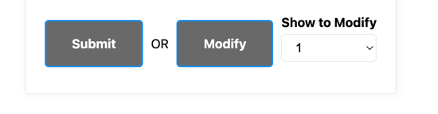

## TV Show Progress Tracker
https://a3-nicholas-houghton.onrender.com/
Nicholas Houghton

This is a TV Show progress tracker which allows multiple users to track the TV shows they are watching. The goal is, after logging in, to allow you to enter the name of any tv show you have or are currently watching, and then include the number of episodes you have seen, and then the total number of episodes in the show.
After entering that, the derived field is the percent complete field, which shows you what percent through the show you are.
You can also modify a show you have already added, to update the # of episodes through you are. 

To use the application, you must first login. Here are premade accounts:  
User: Admin Password: Admin  
User: Admin2 Password: Admin2  
After logging in, you are greeted with the form to submit more shows, and your already submitted shows that are stored in mongo db. The server is made with express. To add a new show, you fill in the fields and press submit. To modify, you fill in the fields, and select the number row that corresponds with the show you want to modify, and press modify. 

Some challenges that were faced while making this was definitely adapting my CSS to fit with a new framework. After using a new framework, I had to change or remove a good amount of my CSS to make it look better.

Cookie-session was used for authentication. After login, the server uses a cookie to store it. I choose this since there was a great example of it uploaded to the class github syllabus, so I thought it would be good to implement. 

For CSS framework, I used MVP.css (https://andybrewer.github.io/mvp/). I used this because I liked the simple design of it, and it did not rely on classes, which worked for my application as I do not have classes on everything.   
The CSS I used was to center everything(form buttons, table, loggout button, modify options). For a simple form like this, I thought it was best to center everything.  
I also did some styling to comply with lighthouse. I had to change the background color on table elements and buttons to dim gray top get the lighthouse score to 100%. I also added a separator bar and spacing between my form buttons. 

## Technical Achievements
- **Tech Achievement 1**: I got 100% on all 4 lighthouse tests for this assignment. This was difficult since I had to do some custom colors instead of solely relying on the framework (images below). I also had to stop using google fonts for performance
- 
  

- **Tech Achievement 2**: I used 5 Express middleware Packages:
  - Cookie-session: Creates cookie-bases sessions which I used so the server remembers which user is logged in 
  - Morgan: This logs HTTP requests to the console and also includes the status code which is useful for debugging
  - Connect-Timeout: Sets a maximum length of time the server has to respond before cancelling it. This is useful since my servers are on free versions and this can cancel bad requests
  - Response-Time: This shows how long the server takes to respond to a request
  - Serve-Favicon: This shows the icon for the website and lets me include a real icon for it so when you see the tv icon in the browser, thats what this is. The icon i used is from here: https://www.flaticon.com/free-icon/tv_5988394

### Design/Evaluation Achievements
**Design Achievement 1**: My site uses the CRAP principles in the Non-Designer's Design Book readings:

Contrast: My page uses strong contrast as described in the book reading in multiple different ways. To make text clear and readable, the background of the website is white while the text is black to make the page the most readable and to ensure the Google lighthouse accessibility score is good. The element on my pages that got the most emphasis was the titles. The Login page specifically mentions "TV Show Progress Tracker Login" in large bold text, and the main page Shows "TV Show Progress Tracker: (YOURUSERNAME)" in large bold text as well to make it easily readable. Lastly, the book explains that contrast should be strong and not subtle, and that if two things are different make them really different, and this is also why the buttons on my page have a strong gray background and white text on them, to make it clear that these are how you interact with the website versus just reading it. It differentiates it from other information on the website 

Repetition: My page uses repetition in many ways as mentioned from the book. The book mentions at the top of that chapter that you should reuse design elements through the entire piece. Throughout the website, I used the one font throughout the entire application which is provided from the MVP CSS framework. Since I also used this template, it means that other elements throughout the page have similar styles. All of the buttons have a blue border, gray background, and white text to make it easy to notice and recognize that you need to interact with it. I also keep the same boldness and larger font size for all of the page headings and titles to improve the usability of the site. Another element mentioned in the chapter is spacing, so on the main screen I edited the CSS manually to ensure equal spacing between groups of elements (Form Vs Table).  

Alignment: As this chapter mentions at the start, nothing should be placed arbitrarily and every item should have a visual connection. I used alignment to make my site intuitive and easy to use. For example, one of the primary ways I used it was on the submit or modify options for the form (screenshot included below paragraph). I wanted to make modifying the form simple, so I thought it would be intuitive to allow you to select which option from the form to modify, and then press modify instead of submit. I put these all in one row, and the modify button directly next to the selector to make it easy to understand. I also used proximity to space out different major elements like the form, the table, and the headings. 
  

Proximity: Lastly I used proximity throughout my website to group related items together and items that are not related apart. I'll start by mentioning the gaps I created in main.css. There are intentional gaps between the table and the form, as well as a larger gap between the heading and all other information. I also added a divider bar between the form and the table to make the distinction even more clear that the table is for viewing your data, and the form for adding. I grouped all the related form actions like submit and modify together, and I also ensured that all of the form items are grouped together cleanly as well. Lastly, on the login page, I put the description about how creating new accounts work right above the form, so users see that when first on the website. 