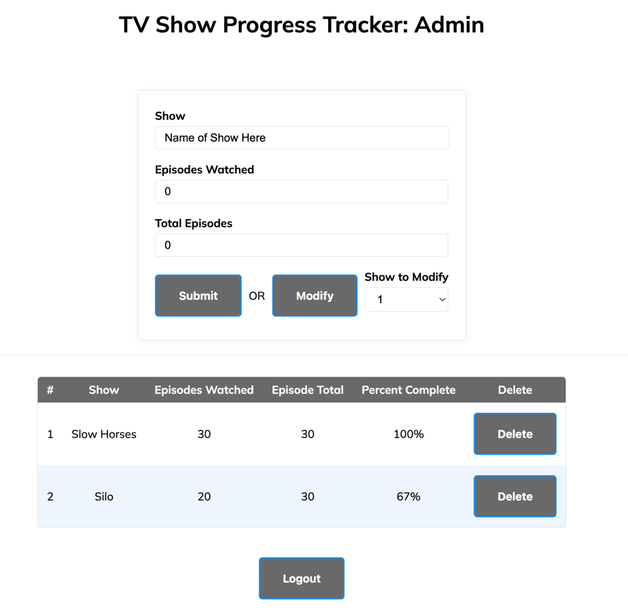
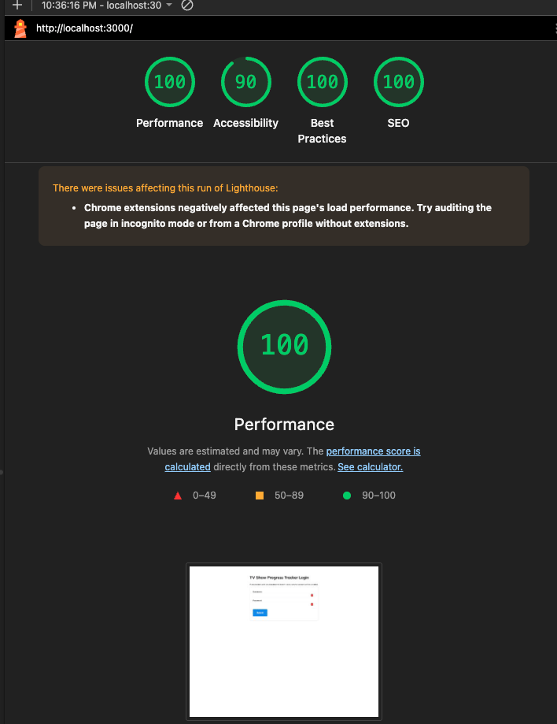
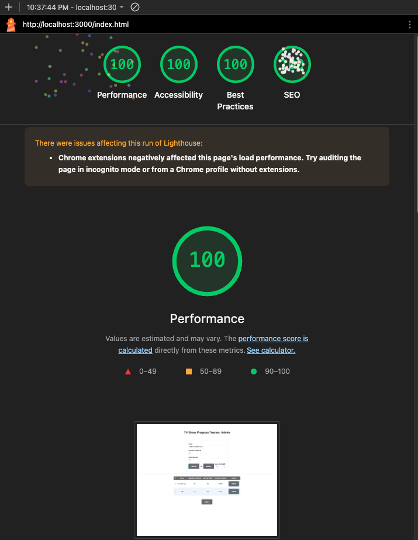

Assignment 3 - Persistence: Two-tier Web Application with Database, Express server, and CSS template
===

Due: September 15th, by 1:59 PM.

This assignment continues where we left off in A2, extending it to use a popular Node.js server framework (express), a database (mongodb), and a CSS application framework / template of your choice (Bootstrap, Material Design, Semantic UI, Pure etc.)

Baseline Requirements
---

Your application is required to implement the following functionalities:

- a `Server`, created using Express (no alternatives will be accepted for this assignment)
- a `Results` functionality which shows all data associated with a logged in user (except passwords)
- a `Form/Entry` functionality which allows users to add, modify, and delete data items (must be all three!) associated with their user name / account. 
- Persistent data storage in between server sessions using [mongodb](https://www.mongodb.com/cloud/atlas) (you *must* use mongodb for this assignment). You can use either the [official mongodb node.js library](https://www.npmjs.com/package/mongodb) or use the [Mongoose library](https://www.npmjs.com/package/mongoose), which enables you to define formal schemas for your database. Please be aware that the course staff cannot provide in-depth support for use of Mongoose.  
- Use of a [CSS framework or template](https://github.com/troxler/awesome-css-frameworks). 
This should do the bulk of your styling/CSS for you and be appropriate to your application. 
For example, don't use [NES.css](https://nostalgic-css.github.io/NES.css/) (which is awesome!) unless you're creating a game or some type of retro 80s site.

Your application is required to demonstrate the use of the following concepts:  

HTML:  
- HTML input tags and form fields of various flavors (`<textarea>`, `<input>`, checkboxes, radio buttons etc.)
- HTML that can display all data *for a particular authenticated user*. Note that this is different from the last assignnment, which required the display of all data in memory on the server.

Note that it might make sense to have two pages for this assignment, one that handles login / authentication, and one that contains the rest of your application.
For example, when visiting the home page for the assignment, users could be presented with a login form. After submitting the login form, if the login is 
successful, they are taken to the main application. If they fail, they are sent back to the login to try again. For this assignment, it is acceptable to simply create 
new user accounts upon login if none exist, however, you must alert your users to this fact.  

CSS:  
- CSS styling should primarily be provided by your chosen template/framework. 
Oftentimes a great deal of care has been put into designing CSS templates; 
don't override their stylesheets unless you are extremely confident in your graphic design capabilities. 
The idea is to use CSS templates that give you a professional looking design aesthetic without requiring you to be a graphic designer yourself.

JavaScript:  
- At minimum, a small amount of front-end JavaScript to get / fetch data from the server. 
See the [previous assignment](https://github.com/cs-4241-23/shortstack) for reference.

Node.js:  
- A server using Express and a persistent database (mongodb).

General:  
- Your site should achieve at least 90% on the `Performance`, `Best Practices`, `Accessibility`, and `SEO` tests 
using Google [Lighthouse](https://developers.google.com/web/tools/lighthouse) (don't worry about the PWA test, and don't worry about scores for mobile devices).
Test early and often so that fixing problems doesn't lead to suffering at the end of the assignment. 

Deliverables
---

Do the following to complete this assignment:

1. Implement your project with the above requirements. I'd begin by converting your A2 assignment. First, change the server to use express. Then, modify the server to use mongodb instead of storing data locally. Last but not least, implement user accounts and login. User accounts and login is often the hardest part of this assignment, so budget your time accordingly.
2. Deploy your project to Render and fill in the appropriate fields in your package.json file.
3. Test your project to make sure that when someone goes to your main page on Render, it displays correctly.
4. Ensure that your project has the proper naming scheme `a3-yourfirstname-yourlastname` so we can find it.
5. Fork this repository and modify the README to the specifications below.
6. Create and submit a Pull Request to the original repo. Name the pull request using the following template: `a3-firstname-lastname`.

Achievements
---

Below are suggested technical and design achievements. You can use these to help boost your grade up to an A and customize the 
assignment to your personal interests, for a maximum twenty additional points and a maximum grade of a 100%. 
These are recommended achievements, but feel free to create/implement your own... just make sure you thoroughly describe what you did in your README, 
why it was challenging, and how many points you think the achievement should be worth. 
ALL ACHIEVEMENTS MUST BE DESCRIBED IN YOUR README IN ORDER TO GET CREDIT FOR THEM.

*Technical*
- (10 points) Implement OAuth authentication, perhaps with a library like [passport.js](http://www.passportjs.org/). 
*You must either use Github authenticaion or provide a username/password to access a dummy account*. 
Course staff cannot be expected, for example, to have a personal Facebook, Google, or Twitter account to use when grading this assignment. 
Please contact the course staff if you have any questions about this. This is the hardest achievement in Webware; you have been warned!  
- (5 points) Get 100% (not 98%, not 99%, but 100%) in all four lighthouse tests required for this assignment.
- (up to 5 points) List up to five Express middleware packages you used and a short (one sentence) summary of what each one does. THESE MUST BE SEPARATE PACKAGES THAT YOU INSTALL VIA NPM, NOT THE ONES INCLUDED WITH EXPRESS. So express.json and express.static don't count here. For a starting point on middleware, see [this list](https://expressjs.com/en/resources/middleware.html).

*Design/UX*
- (10 points) Make your site accessible using the [resources and hints available from the W3C](https://www.w3.org/WAI/), Implement/follow twelve tips from their [tips for writing](https://www.w3.org/WAI/tips/writing/), [tips for designing](https://www.w3.org/WAI/tips/designing/), and [tips for development](https://www.w3.org/WAI/tips/developing/). *Note that all twelve must require active work on your part*. 
For example, even though your page will most likely not have a captcha, you don't get this as one of your twelve tips to follow because you're effectively 
getting it "for free" without having to actively change anything about your site. 
Contact the course staff if you have any questions about what qualifies and doesn't qualify in this regard. 
List each tip that you followed and describe what you did to follow it in your site.
- (5 points) Describe how your site uses the CRAP principles in the Non-Designer's Design Book readings. 
Which element received the most emphasis (contrast) on each page? 
How did you use proximity to organize the visual information on your page? 
What design elements (colors, fonts, layouts, etc.) did you use repeatedly throughout your site? 
How did you use alignment to organize information and/or increase contrast for particular elements. 
Write a paragraph of at least 125 words *for each of the four principles* (four paragraphs, 500 words in total).

Sample Readme (delete the above when you're ready to submit, and modify the below so with your links and descriptions)
---

## TV Show Progress Tracker

https://a3-nicholas-houghton.onrender.com/

This is a TV Show progress tracker which allows multiple users to track the TV shows they are watching. The goal is, after logging in, to allow you to enter the name of any tv show you have or are currently watching, and then include the number of episodes you have seen, and then the total number of episodes in the show.
After entering that, the derived field is the percent complete field, which shows you what percent through the show you are.
You can also modify a show you have already added, to update the # of episodes through you are. 

To use the application, you must first login. Here are premade accounts:  
User: Admin Password: Admin  
User: Admin2 Password: Admin2  
After logging in, you are greeted with the form to submit more shows, and your already submitted shows that are stored in mongo db. To add a new show, you fill in the fields and press submit. To modify, you fill in the fields, and select the number row that corresponds with the show you want to modify, and press modify. 

Some challenges that were faced while making this was definitely adapting my CSS to fit with a new framework. After using a new framework, I had to redo a good amount of CSS work to make it look better.

Cookie-session was used for authentication. After loigin, the server uses a cookie to store it. I choose this since there was a great example of it uploaded to the class github syllabus, so I thought it would be good to implement. 

For CSS framework, I used MVP.css (https://andybrewer.github.io/mvp/). I used this because I liked the simple design of it, and it did not rely on classes, which worked for my application as I do not have classes on everything.   
The CSS I used was to use my own font from google fonts, and to center everything(form buttons, table, loggout button, modify options). For a simple form like this, I thought it was best to center everything.  
I also did some styling to comply with lighthouse. I had to change the background color on table elements and buttons to dim gray top get the lighthouse score to 100%. I also added a separator bar and spacing between my form buttons. 

## Technical Achievements
- **Tech Achievement 1**: I got 100% on all 4 lighthouse tests for this assignment. This was difficult since I had to do some custom colors instead of solely relying on the framework (images below)
- 
  

- **Tech Achievement 2**: I used 5 Express middleware Packages:
  - Cookie-session: Creates cookie-bases sessions which I used so the server remembers which user is logged in 
  - Morgan: This logs HTTP requests to the console and also includes the status code which is useful for debugging
  - Connect-Timeout: Sets a maximum length of time the server has to respond before cancelling it. This is useful since my servers are on free versions and this can cancel bad requests
  - Response-Time: This shows how long the server takes to respond to a request
  - Serve-Favicon: This shows the icon for the website and lets me include a real icon for it so when you see the tv icon in the browser, thats what this is. The icon i used is from here: https://www.flaticon.com/free-icon/tv_5988394

### Design/Evaluation Achievements
- **Design Achievement 1**: I followed the following tips from the W3C Web Accessibility Initiative...
  https://www.flaticon.com/free-icon/tv_5988394